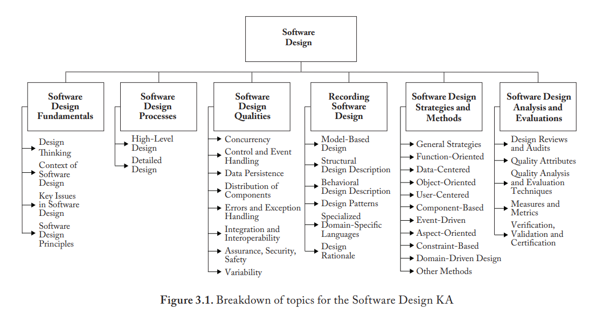

= Standardization and IT certification strategy planning

NOTE: Selected role: backend developer

== 1. Impact of standards on software development

=== SWEBOK Software design KA (knowledge area) overview

Design Thinking (5 basic steps)
. Crystallize a purpose or objective
. Formulate a concept for how the purpose can be achieved
. Devise a mechanism that implements the conceptual structure
. Introduce a notation for expressing the capabilities of the mechanism and
  invoking its use
. Describe the usage of the notation in a specific problem context to invoke
  the mechanism so the purpose is achieved

[quote]
----
...much of software design consists of creating the necessary vocabulary to
express a problem, express its solution and implement that solution
----

Software design is the transformation of customer and other requirements,
needs, and concerns into implementable design specifications. Its contexts
include the following:

* Software Design’s relationship with software requirements: The requirements
  establish a set of problems that the software design must solve.
* Software Design’s relationship with software architecture: In cases where an
  architecture has been established, that architecture constrains the design by
  capturing fundamental aspects of the system: such as its major components and
  their interconnections, application programming interfaces (APIs), styles and
  patterns to be used, and architectural principles to be observed and
  enforced.
* Software Design’s relationship with software construction: The software
  design must provide a guide to implementors on building the system.
* Software Design’s relationship with software testing: Software design
  provides a foundation for an overall testing strategy and test cases that
  ensure that the design is properly implemented and operates as intended.

Software design principles:
* Abstraction
* Separation of concerns
* Modularization (decomposition)
* Encapsulation
* Separation of interface and implementation
* Coupling
* Cohesion
* Uniformity
* Completeness
* Verifiability

Software design processes:

Architectural design stage:: The architectural design stage addresses the
fundamentals of the system as a whole and in relation to its environment.

High-level design stage:: is outward-facing — developing the top-level
structure and organization of the software, identifying its various components
and how that software system and its components interact with the environment
and its elements.

Detailed design stage:: is inward-facing — specifying each component in
sufficient detail to facilitate its construction and to meet its outside
obligations, including how software components are further refined into modules
and units.

=== Impact of "Software design" KA on software development

The selected section of the standard defines a solid foundation of filling the
gap between software requirements and software construction. Software design by
itself can be viewed as a form of problem-solving, so breaking the transition
into smaller pieces, and highlighting of important aspects makes the process
manageable and easier to estimate. The outcomes of this stage of software
development are technical guides constraining the developers both providing the
answers to general questions on inward perspective like "How do we organize the
code?, "How do software modules interact?", and outward like "How data should
be stored?", "What protocol is used for communication with system A?".

=== Impact of programming language specification

At the stage of software architecture, when choosing a technology stack, the
language specification may come in handy for understanding the guaranteed
behaviour of some aspects like concurrency, error handling, that are documented
and *must* be followed by the implementors (e.g. GNU and Clang C++ compilers).

At the stage of software construction, the developers should rely on language
standard to lookup the aspects, which are _implementation-dependant_, and
carefully document the usages of such features (e.g. C++ compiler extensions,
vendor-dependant) and provide related test cases. So, if moving to a different
implementation, it would be easier to investigate possible "unexpected" issues.

== 2. Certification programs classification

[cols="1,1,1,2"]
|===
|Certification type
|Program
|Provider
|Goal

|Vendor-specific
|Java SE 21 Developer Professional
|Oracle
|Proficiency in Java programming

|Vendor-neutral
|SEI Software Architecture Professional Certificate
|Carnegie Mellon University
|Practices for designing, analyzing, documenting, and implementing software architectures

|Entry-level
|Java Foundations
|Oracle
|Basic understanding of Java programming language and concepts and have mathematical, logical, and analytical problem-solving skills
|===

== 3. What are some certification exams like?

Certification: Spring Certified Professional 2024 provided by VMware (owned by
Broadcom)

Format:: Computer-based, delivered at Pearson VUE centers

Exam Language:: English

Duration:: 130 minutes

Number of Questions:: 60 single and multiple choice

Proctoring:: Qualified proctors through independent test centers, on Broadcom's
behalf, administer the certification exams.  The exam is "closed book" (no
printed material, computers or calculators are allowed)

Passing Score:: 300 (Scaled) 

Pricing:: $250 USD, $49 for Broadcom employees

Recertification:: after 3 days (first attempt), 2 weeks (second attempt)

Certification expires:: after 2 years
